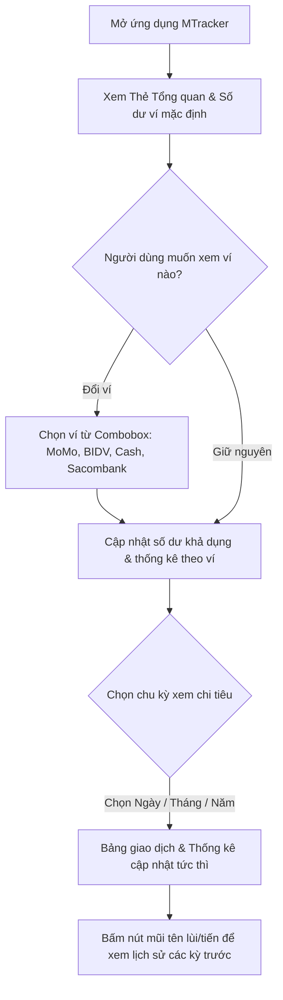
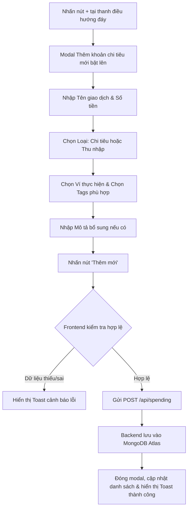
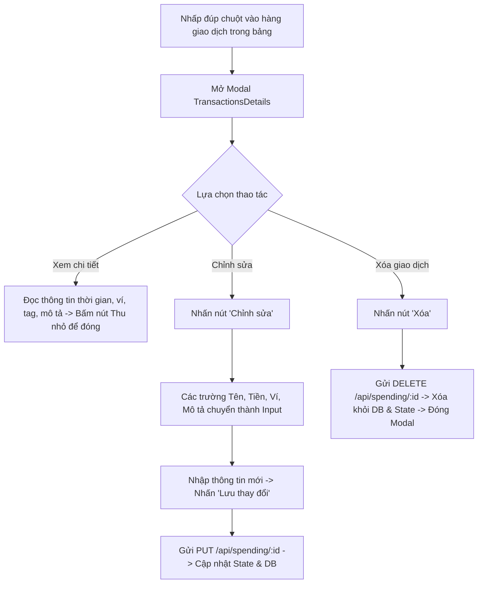

# 💰 MoneyM (MTracker) - Ứng Dụng Quản Lý Chi Tiêu Cá Nhân

> **Live Application**: [https://mtraker.onrender.com/](https://mtraker.onrender.com/)  
> **Repository**: `MoneyM` (Monorepo Full-stack)

---

## 📌 1. Giới thiệu dự án

**MoneyM (MTracker)** là ứng dụng web quản lý tài chính và chi tiêu cá nhân hiện đại, trực quan, hỗ trợ theo dõi thu chi theo thời gian thực, quản lý đa nguồn tiền (ví tiền mặt, thẻ ngân hàng, ví điện tử) và phân tích thống kê biến động tài chính theo Ngày / Tháng / Năm.

Ứng dụng được thiết kế ưu tiên trải nghiệm trên thiết bị di động (Mobile-First) với phong cách giao diện Dark/Light hiện đại, kết hợp điểm nhấn màu neon (#ccff00), mang lại cảm giác mượt mà và thao tác nhanh chóng cho người dùng.

---

## 🛠️ 2. Tech Stack sử dụng

Hệ thống được xây dựng theo mô hình **Monorepo** kết hợp Client - Server trên cùng một repository, tối ưu cho việc triển khai nhanh trên nền tảng cloud (Render).

### 🖥️ Frontend
- **Framework & Core**: [React 19](https://react.dev/) (v19.2) - Kiến trúc Component-driven kết hợp Custom Hooks tách biệt logic nghiệp vụ.
- **Build Tool**: [Vite 8](https://vitejs.dev/) (v8.1.5) - Tốc độ HMR cực nhanh, tối ưu hóa bundle đầu ra (dưới 500KB JS gzip ~159KB).
- **Styling & Theme**:
  - [Tailwind CSS v4](https://tailwindcss.com/) - Công cụ CSS hiệu năng cao với cấu hình `@theme` và `@custom-variant`.
  - [Radix UI Primitives](https://www.radix-ui.com/) (`@radix-ui/react-dialog`, `@radix-ui/react-popover`, `@radix-ui/react-slot`).
  - [Geist Font](https://vercel.com/font) & [Be Vietnam Pro](https://fonts.google.com/specimen/Be+Vietnam+Pro) - Đảm bảo hiển thị tiếng Việt hoàn hảo.
  - `class-variance-authority` (CVA), `clsx`, `tailwind-merge` (`cn` helper).
- **Icons & Visuals**: [Lucide React](https://lucide.dev/) (v1.16).
- **Notifications**: [Sonner](https://sonner.emilkowal.ski/) (v2.0.7) - Toast notification thông báo kết quả thao tác.
- **HTTP Client**: [Axios](https://axios-http.com/) (v1.13.5) với cấu hình `baseURL` linh hoạt theo môi trường Dev/Prod.

### ⚙️ Backend
- **Runtime**: [Node.js](https://nodejs.org/) (ES Modules `type: module`).
- **Web Framework**: [Express 5](https://expressjs.com/) (v5.2.1) - Xử lý RESTful API và phục vụ tệp tĩnh Production với routing wildcard `{ *path }`.
- **Database**: [MongoDB Atlas](https://www.mongodb.com/atlas) (Cloud Database).
- **ODM**: [Mongoose 9](https://mongoosejs.com/) (v9.3.0) - Định nghĩa Schema, Data Validation và truy vấn dữ liệu.
- **Middleware & Utility**:
  - `cors`: Cấu hình chia sẻ tài nguyên cross-origin.
  - `dotenv`: Quản lý biến môi trường (`PORT`, `MONGO_URI`, `NODE_ENV`).
  - `dns`: Thiết lập custom DNS server (`8.8.8.8`) để giải quyết lỗi phân giải SRV DNS của MongoDB Atlas.

### ☁️ Triển khai & Vận hành (Deployment)
- **Nền tảng**: [Render.com](https://render.com/) Web Service.
- **Cơ chế triển khai**: Express phục vụ trực tiếp thư mục `frontend/dist` khi `NODE_ENV=production`. Tất cả các request không thuộc `/api/*` sẽ được điều hướng về `index.html` của Single Page App.

---

## 📂 3. Cấu trúc thư mục dự án

```
MoneyM/
├── package.json               # Root scripts (build fullstack, start server)
├── backend/
│   ├── package.json
│   ├── .env                   # Biến môi trường backend
│   └── src/
│       ├── server.js          # Khởi chạy Express server & Static serving
│       ├── Lib/
│       │   └── db.js          # Kết nối MongoDB Atlas (Mongoose)
│       ├── Model/
│       │   └── Spending.js    # Schema Mongoose cho Transaction
│       ├── Controller/
│       │   └── spendingController.js # CRUD handlers cho chi tiêu
│       └── Routes/
│           └── spendingRoutes.js     # API Route definitions
└── frontend/
    ├── package.json
    ├── vite.config.js
    ├── index.html
    └── src/
        ├── App.jsx            # Layout container & Điều phối state chính
        ├── main.jsx           # Entrypoint React 19
        ├── index.css          # Tailwind CSS v4 & theme variables
        ├── components/        # Thư mục UI Components
        │   ├── Header.jsx           # Thanh thương hiệu & chuông thông báo
        │   ├── DateFilter.jsx       # Bộ chọn Ngày/Tháng/Năm
        │   ├── TotalBalance.jsx     # Thẻ số dư & thống kê chi tiêu
        │   ├── TransactionTable.jsx # Bảng danh sách & điều hướng thời gian
        │   ├── TransactionItem.jsx  # Hàng hiển thị chi tiết khoản chi
        │   ├── TransactionsDetails.jsx # Modal chi tiết & Form sửa/xóa
        │   ├── TransactionForm.jsx  # Modal thêm mới giao dịch
        │   ├── TablePagination.jsx  # Thanh phân trang
        │   ├── NavBar.jsx           # Dock bar cố định ở đáy kèm nút (+)
        │   └── ui/                  # Primitives (MyCombobox, Dialog, Button,...)
        ├── hooks/             # Custom Hooks tách biệt logic
        │   ├── useTransactions.js        # Lọc giao dịch & tính thống kê
        │   ├── useWalletTransaction.js   # Tính toán số dư ví & nạp/rút
        │   ├── useFormHandling.js        # Quản lý form tạo mới
        │   ├── useUpdateTrans.js         # Quản lý form chỉnh sửa
        │   └── usePagination.js          # Quản lý logic chia trang
        ├── services/
        │   └── SpendingServices.js       # Gọi API backend qua Axios
        ├── utils/             # Hàm tiện ích thuần túy
        │   ├── DateUtils/                # Kiểm tra ngày/tháng/năm & offset
        │   ├── SpendingUtils/            # Tính tổng tiền, tỉ lệ %, danh mục top
        │   └── WalletUtils/              # Cập nhật số dư trong Map
        └── lib/
            ├── axios.js                  # Axios instance chuẩn
            ├── mockData.js               # Dữ liệu khởi tạo các loại ví
            └── utils.js                  # Helper cn (clsx + twMerge)
```

---

## 🌟 4. Các tính năng chính của hệ thống

### 1. Thống kê & Tổng quan tài chính (Financial Dashboard)
- **Số dư khả dụng (Available Balance)**: Hiển thị số dư hiện tại của loại ví đang chọn, tính theo công thức:
  $$\text{Số dư} = \text{Số dư ban đầu} - \text{Tổng chi all-time} + \text{Tổng thu all-time}$$
- **Ẩn/Hiện số dư**: Nút Icon Con mắt (`Eye` / `EyeOff`) cho phép bảo mật số dư ở nơi công cộng.
- **Tổng chi theo mốc thời gian**: Tự động tính tổng tiền đã chi trong Ngày / Tháng / Năm đang chọn.
- **So sánh kỳ trước (%)**: Tính toán phần trăm tăng/giảm so với kỳ liền kề (hôm qua, tháng trước, năm trước) kèm chỉ báo trực quan màu Xanh (giảm chi) hoặc Đỏ (tăng chi).
- **Danh mục chi tiêu nhiều nhất (Top Category)**: Tự động gom nhóm và tìm danh mục chiếm ngân sách lớn nhất (Ăn uống, Đi lại, Giải trí) kèm phần trăm đóng góp trên tổng chi.

### 2. Quản lý đa ví (Multi-Wallet Management)
- Hỗ trợ 4 loại ví thông dụng:
  - 💵 **Tiền mặt (Cash)**
  - 📱 **Ví MoMo**
  - 🏦 **Ngân hàng BIDV**
  - 🏦 **Ngân hàng Sacombank**
- Cho phép chuyển đổi nhanh qua Combobox.
- Hỗ trợ thao tác giả lập **Nạp tiền** hoặc **Rút tiền** trực tiếp trên thẻ ví.

### 3. Lọc & Điều hướng thời gian linh hoạt (Time Filter & Navigation)
- Lọc tức thì theo 3 cấp độ: **Ngày**, **Tháng**, **Năm**.
- Bộ điều khiển lùi/tiến thời gian bằng nút `ChevronFirst` / `ChevronLast` với biến `offset`:
  - `offset = 0`: Mốc hiện tại (Hôm nay, Tháng này, Năm nay).
  - `offset = 1`: Kỳ trước (Hôm qua, Tháng trước, Năm trước).
  - `offset = n`: Lùi về $n$ ngày/tháng/năm trong quá khứ.

### 4. Quản lý giao dịch thu chi (Transaction CRUD)
- **Thêm giao dịch (Create)**:
  - Chọn phân loại: **Chi tiêu** (Expense) hoặc **Thu nhập** (Income).
  - Chọn loại ví thực hiện giao dịch (Tiền mặt, BIDV, MoMo, Sacombank).
  - Nhập số tiền, tên khoản thu/chi, mô tả chi tiết.
  - Gắn nhãn danh mục (Tags): Ăn uống (`#food`), Đi lại (`#travel`), Giải trí (`#entertainment`).
- **Xem danh sách (Read)**:
  - Hiển thị danh sách thu gọn theo kỳ đã lọc.
  - Đánh dấu màu sắc: Đỏ cho khoản chi (`-`), Xanh cho khoản thu (`+`).
  - Định dạng hiển thị giờ/phút và nhãn tag.
- **Xem chi tiết & Chỉnh sửa (Detail & Update)**:
  - Thao tác nhấp đúp (Double click) vào một giao dịch để mở Modal chi tiết.
  - Chuyển đổi sang chế độ chỉnh sửa để cập nhật Tên, Số tiền, Loại ví, Mô tả.
  - Đồng bộ tức thì lên MongoDB Atlas qua API `PUT`.
- **Xóa giao dịch (Delete)**:
  - Nút xóa trực tiếp trong Modal chi tiết kèm cảnh báo Sonner Toast.

### 5. Phân trang giao dịch (Pagination)
- Tự động chia nhỏ danh sách (4 giao dịch / trang) giúp giao diện luôn gọn gàng và không bị tràn màn hình.
- Hỗ trợ nút Lùi trang (Prev), Tiến trang (Next) và số trang cụ thể.

---

## 🔄 5. Luồng người dùng (User Flows)

### 📊 Luồng 1: Xem bảng tin & Kiểm tra ngân sách


### ➕ Luồng 2: Thêm mới một khoản thu/chi


### ✏️ Luồng 3: Xem chi tiết, Chỉnh sửa và Xóa giao dịch


---

## 📡 6. Tài liệu API (REST Endpoints)

Base URL Production: `https://mtraker.onrender.com/api`  
Base URL Local: `http://localhost:5001/api`

| Phương thức | Đường dẫn | Mô tả chức năng | Body yêu cầu |
|:---:|:---|:---|:---|
| `GET` | `/spending` | Lấy toàn bộ danh sách giao dịch | Không |
| `POST` | `/spending` | Thêm mới một khoản thu/chi | `title`, `amount`, `type`, `walletType`, `tag`, `description` |
| `PUT` | `/spending/:id` | Cập nhật thông tin giao dịch theo ID | `title`, `amount`, `type`, `walletType`, `tag`, `description` |
| `DELETE` | `/spending/:id` | Xóa giao dịch theo ID | Không |

---

## 🚀 7. Hướng dẫn chạy dự án cục bộ (Local Development)

### Yêu cầu môi trường
- [Node.js](https://nodejs.org/) version `>= 18.0.0`
- [MongoDB Atlas](https://cloud.mongodb.com/) URI hoặc MongoDB Local

### Bước 1: Clone mã nguồn
```bash
git clone https://github.com/TunDev31/MTraker.git
cd MTraker
```

### Bước 2: Cài đặt Dependencies
Cài đặt cho cả Backend và Frontend thông qua lệnh tại thư mục gốc:
```bash
npm run build
```
Hoặc cài thủ công từng phần:
```bash
cd backend && npm install
cd ../frontend && npm install
```

### Bước 3: Cấu hình biến môi trường
Tạo tệp `.env` trong thư mục `backend/`:
```env
PORT=5001
NODE_ENV=development
MONGO_URI=mongodb+srv://<username>:<password>@cluster.mongodb.net/moneym?retryWrites=true&w=majority
```

### Bước 4: Chạy ứng dụng
- **Chạy Backend**:
  ```bash
  npm run start --prefix backend
  # Server chạy tại http://localhost:5001
  ```
- **Chạy Frontend (Dev server)**:
  ```bash
  npm run dev --prefix frontend
  # Client chạy tại http://localhost:5173
  ```

---

## 📄 8. Liên kết tài liệu liên quan
- **Báo cáo kiểm thử & Tối ưu hóa**: Xem chi tiết tại [AUDIT_REPORT.md](./AUDIT_REPORT.md) để nắm rõ danh sách các lỗi tiềm tàng, phân tích bảo mật và giải pháp nâng cấp mã nguồn.
