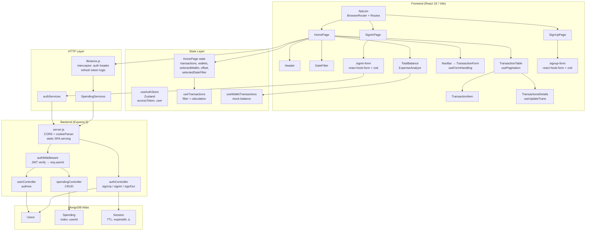

# 📋 CODE REVIEW REPORT — MoneyM (MTracker) v0.4.2.1

> **Reviewer:** Antigravity Senior Full-stack & Security Review  
> **Ngày review:** 28/09/2026  
> **Commit HEAD:** `0f2af5e` (hotfix0.4.2.1)  
> **Môi trường:** Express 5 + Mongoose 9 + React 19 + Vite 8 + Tailwind v4  
> **Live:** https://mtraker.onrender.com

---

## 1. Executive Summary

### Điểm đánh giá tổng thể

| Mảng | Điểm | Ghi chú |
|---|---|---|
| **Security** | 4/10 | Thiếu rate limit, helmet, IDOR tiềm tàng, mass assignment chưa sửa |
| **Correctness** | 5/10 | Một số bug từ report trước còn tồn tại, Session TTL typo, radio logic sai |
| **Performance** | 5/10 | Lấy toàn bộ collection không phân trang, mỗi request gọi DB dù không cần |
| **Maintainability** | 5/10 | Logic trùng lặp giữa 2 hooks, naming không nhất quán, 45 lỗi ESLint |
| **Testing** | 0/10 | Zero test — không unit, không integration, không e2e |
| **UX/A11y** | 5/10 | Double-click không hoạt động trên mobile, thiếu loading state, thiếu aria |

### Top 5 rủi ro lớn nhất

1. 🔴 **Mass Assignment** — `updateSpending` pass `req.body` thẳng vào MongoDB, user có thể overwrite `userId`, `_id`
2. 🔴 **Không có rate limiting** — endpoint `/signin` dễ bị brute-force
3. 🔴 **Session TTL typo** — `expiredAfterSeconds` (sai) → sessions tích lũy vô hạn trong DB
4. 🟠 **`req.userId` chưa đủ bảo vệ** — middleware gán `req.userId = user._id` nhưng chỉ một phần logic sửa, `GET /spending` vẫn không lọc đúng nếu `userId` undefined edge case
5. 🟠 **Wallet state mất khi reload** — toàn bộ số dư ví là mock hardcode, mọi thao tác Nạp/Rút mất sau F5

---

## 2. Kiến trúc thực tế



**Nhận xét kiến trúc:**
- Monorepo tốt cho giai đoạn đầu, Express serve static hợp lý trên Render.
- State quản lý theo 2 lớp rõ ràng: Zustand cho auth, local `useState` cho transactions. Tuy nhiên wallet state cần persistence.
- Axios interceptors đúng pattern nhưng chưa có backend endpoint tương ứng (`/auth/refresh-token`).
- Custom hooks tách biệt nghiệp vụ tốt, nhưng `useFormHandling` và `useUpdateTrans` trùng lặp ~70% logic.

---

## 3. Đối chiếu với AUDIT_REPORT.md (báo cáo cũ)

> `AUDIT_REPORT.md` bị gitignore nên không tồn tại trong working tree. Đối chiếu với `code_review.md` (commit `9a0b839`, đã bị xóa ở commit `745545f`).

| ID cũ | Nhận định cũ | Trạng thái hiện tại | Ghi chú |
|---|---|---|---|
| BUG-01 | `req.userId` undefined | ✅ **ĐÃ SỬA** | `authMiddleware.js:22` gán `req.userId = user._id` |
| BUG-02 | Refresh token endpoint không tồn tại | ❌ **CHƯA SỬA** | Frontend vẫn gọi `/auth/refresh-token`, backend không có route |
| BUG-03 | Session TTL typo `expiredAfterSeconds` | ❌ **CHƯA SỬA** | Vẫn sai tên key |
| BUG-04 | `displayedName` dùng `+` | ❌ **CHƯA SỬA** | Vẫn là `` `${firstName}+${lastName}` `` |
| BUG-05 | `sort({ date: -1 })` sai field | ✅ **ĐÃ SỬA** | Đã sửa thành `sort({ createdAt: -1 })` |
| BUG-06 | `usePagination` useMemo sau useEffect | ❌ **CHƯA SỬA** | Vẫn còn vấn đề thứ tự khai báo |
| BUG-07 | `toast` không import ở HomePage | ✅ **ĐÃ SỬA** | Đã thêm `import { toast } from "sonner"` |
| BUG-08 | Radio button logic sai ở TotalBalance | ❌ **CHƯA SỬA** | Vẫn dùng 2 `name` khác nhau, `checked` ngược |
| BUG-09 | 3 `<Routes>` riêng biệt | ✅ **ĐÃ SỬA** | Gộp vào 1 `<Routes>` |
| MAJ-01 | Mass Assignment `updateSpending` | ❌ **CHƯA SỬA** | Vẫn pass `req.body` trực tiếp |
| MAJ-02 | Không có Protected Route | ❌ **CHƯA SỬA** | Chưa có guard route ở frontend |
| MAJ-03 | Sau đăng nhập không redirect | ✅ **ĐÃ SỬA** | `signin-form.jsx:38` dùng `navigate("/")` |
| MAJ-04 | HTTP status codes sai | ❌ **CHƯA SỬA** | Vẫn trả 404 cho validation errors |
| MAJ-05 | DB fail không exit | ❌ **CHƯA SỬA** | `db.js` vẫn không gọi `process.exit(1)` |

**Thống kê:** 5/14 issue đã sửa (36%), 9 issue còn tồn tại. Có thêm nhiều phát hiện mới.

---

## 4. Bảng tổng hợp phát hiện

| ID | Severity | Danh mục | Vị trí | Tóm tắt |
|---|---|---|---|---|
| SEC-01 | **Critical** | Security | `spendingController.js:65` | Mass Assignment — `req.body` vào `findOneAndUpdate` |
| SEC-02 | **Critical** | Security | `authMiddleware.js:14` | Thiếu rate limiting trên `/signin` |
| SEC-03 | **High** | Security | `server.js` | Thiếu `helmet`, không có body size limit |
| SEC-04 | **High** | Security | `Session.js:22` | TTL index typo — sessions không bao giờ expire |
| SEC-05 | **High** | Security | `spendingController.js:91` | `error.message` lộ trong response production |
| SEC-06 | **Medium** | Security | `server.js:27` | CORS hardcode ngrok URL — rủi ro khi domain thay đổi |
| SEC-07 | **Medium** | Security | `authController.js` | HTTP 404 cho mọi validation error — status code sai |
| BUG-01 | **High** | Correctness | `axios.js:30` | Refresh token endpoint không tồn tại → 401 loop sau 30 phút |
| BUG-02 | **High** | Correctness | `authController.js:24` | `displayedName: firstName+lastName` — literal `+` |
| BUG-03 | **High** | Correctness | `usePagination.js:6` | `useEffect` tham chiếu `visibleTaskNums` trước khi `useMemo` khai báo |
| BUG-04 | **High** | Correctness | `TotalBalance.jsx:110,127` | Radio "Rút/Nạp": 2 `name` khác nhau + `checked` ngược |
| BUG-05 | **Medium** | Correctness | `authMiddleware.js:14` | 401 invalid token nhưng trả 404 |
| BUG-06 | **Medium** | Correctness | `db.js:12` | DB connect fail không dừng server |
| BUG-07 | **Medium** | Correctness | `useUpdateTrans.js:39` | `amount <= 0` không bị validate (chỉ check `< 0`) |
| BUG-08 | **Medium** | Correctness | `useTransactions.js` | `filteredTrans` luôn filter offset=0 (không theo `offset` prop) |
| PERF-01 | **High** | Performance | `spendingController.js:6` | `GET /spending` lấy toàn bộ collection không phân trang |
| PERF-02 | **Medium** | Performance | `authMiddleware.js:17` | DB query mỗi request — không cache, không cần `req.user` cho `/spending` |
| PERF-03 | **Medium** | Performance | `useTransactions.js` | `filterTransactionsByDate` gọi 3 lần với hầu hết input giống nhau |
| LOGIC-01 | **High** | Business Logic | `mockData.js` + `HomePage.jsx` | Wallet balance = hardcode mock, mất sau reload |
| LOGIC-02 | **Medium** | Business Logic | `useWalletTransaction.js` | `currValue = base - totalExpense_ALL_TIME + totalIncome_ALL_TIME` — tổng không phân biệt filter wallet vs tổng thực |
| LOGIC-03 | **Medium** | Business Logic | `dateChecker.js` | So sánh ngày theo local time của client, backend lưu UTC — có thể lệch múi giờ |
| LOGIC-04 | **Medium** | Business Logic | `CalculateUtils.js:33` | `getMostExpensiveType` dùng `tag[0]` — transaction không có tag sẽ vào nhóm "Khác" |
| LOGIC-05 | **Low** | Business Logic | `ExpenseAnalyze.jsx:19` | `currentExpenseValueByDate` có thể `undefined` nếu `getCurrTotalExpense` trả về `undefined` |
| UX-01 | **High** | UX/A11y | `TransactionItem.jsx:11` | `onDoubleClick` không hoạt động trên mobile/touch device |
| UX-02 | **Medium** | UX/A11y | `HomePage.jsx` | Không có loading state khi fetch transactions |
| UX-03 | **Medium** | UX/A11y | `TransactionForm.jsx` | Duplicate `id="tags"` — vi phạm HTML spec |
| UX-04 | **Medium** | UX/A11y | Toàn bộ modal | Thiếu focus trap, không có `aria-modal`, không có keyboard `Escape` để đóng |
| UX-05 | **Low** | UX/A11y | `useAuthStore.js` | Sign-in thất bại: toast không phân biệt lỗi server vs lỗi mạng |
| MAINT-01 | **Medium** | Maintainability | `useFormHandling` + `useUpdateTrans` | ~70% logic trùng lặp giữa 2 hooks |
| MAINT-02 | **Low** | Maintainability | `useUpdateTrans.js:1,4` | Import `axios` và `api` không dùng |
| MAINT-03 | **Low** | Maintainability | `CalculateUtils.js` | Typo: `getToltalIncome` → `getTotalIncome` |
| MAINT-04 | **Low** | Maintainability | `authRoutes.js:3` | Import `User` không dùng |
| MAINT-05 | **Info** | Maintainability | Toàn bộ dự án | Zero test coverage |

---

## 5. Chi tiết từng phát hiện

---

### SEC-01 · Critical · Mass Assignment trong `updateSpending`

**Vị trí:** [`spendingController.js:65`](file:///d:/MoneyM/backend/src/Controller/spendingController.js#L65)

**Code:**
```js
const updated = await Spending.findOneAndUpdate(
  { _id: id, userId },
  req.body,          // ← Toàn bộ req.body vào DB không lọc
  { new: true }
);
```

**Vấn đề:** Attacker có thể gửi:
```json
{ "userId": "victim_user_id", "title": "Hacked" }
```
Tuy `findOneAndUpdate` filter theo `{ _id, userId }` nên không chiếm được record của người khác, **nhưng** attacker vẫn có thể inject các MongoDB operators:
```json
{ "$set": { "amount": 999999999 } }
```
Ngoài ra, có thể ghi đè `userId`, `__v`, `createdAt`.

**Cách tái hiện:**
```bash
curl -X PUT https://mtraker.onrender.com/api/spending/<any_valid_id> \
  -H "Authorization: Bearer <token>" \
  -H "Content-Type: application/json" \
  -d '{"amount": 999999999, "createdAt": "2020-01-01"}'
```

**Đề xuất sửa:**
```js
// Chỉ cho phép các field cụ thể
const allowedFields = ['title', 'description', 'amount', 'type', 'tag', 'walletType', 'completedAt'];
const updateData = {};
allowedFields.forEach(field => {
  if (req.body[field] !== undefined) updateData[field] = req.body[field];
});

const updated = await Spending.findOneAndUpdate(
  { _id: id, userId },
  { $set: updateData },       // ← Dùng $set tường minh
  { new: true, runValidators: true }
);
```
**Effort:** S

---

### SEC-02 · Critical · Không có rate limiting trên `/signin`

**Vị trí:** [`server.js`](file:///d:/MoneyM/backend/src/server.js) — không có middleware rate limit

**Vấn đề:** Endpoint `POST /api/auth/signin` không giới hạn số lần thử. Attacker có thể brute-force password vô hạn.

**Cách tái hiện:**
```bash
for i in {1..1000}; do
  curl -X POST https://mtraker.onrender.com/api/auth/signin \
    -d '{"userName":"target","password":"guess'$i'"}'
done
```

**Đề xuất sửa:**
```bash
npm install express-rate-limit
```
```js
// server.js
import rateLimit from 'express-rate-limit';

const authLimiter = rateLimit({
  windowMs: 15 * 60 * 1000, // 15 phút
  max: 10,                   // Tối đa 10 lần/15 phút
  message: { message: "Quá nhiều lần thử. Vui lòng thử lại sau 15 phút." },
  standardHeaders: true,
  legacyHeaders: false,
});

app.use("/api/auth/signin", authLimiter);
```
**Effort:** S

---

### SEC-03 · High · Thiếu `helmet`, không có body size limit

**Vị trí:** [`server.js`](file:///d:/MoneyM/backend/src/server.js)

**Vấn đề:**
1. Không có `helmet` → thiếu các security headers (`X-Frame-Options`, `Content-Security-Policy`, `X-Content-Type-Options`...)
2. `express.json()` không giới hạn body size → attacker có thể gửi payload MB để exhaust memory

**Đề xuất sửa:**
```js
import helmet from 'helmet';

app.use(helmet());
app.use(express.json({ limit: '10kb' })); // Giới hạn 10KB
```
**Effort:** S

---

### SEC-04 · High · Session TTL Index typo — sessions không bao giờ tự xóa

**Vị trí:** [`Session.js:22`](file:///d:/MoneyM/backend/src/Model/Session.js#L22)

**Code:**
```js
// ❌ Sai key — MongoDB không nhận dạng, không tạo TTL index
sessionSchema.index({ expiredAt: 1 }, { expiredAfterSeconds: 0 });
//                                       ^^^^^^^ thiếu chữ 'e' ở cuối
```

**Vấn đề:** MongoDB TTL index key đúng là `expireAfterSeconds`. Với typo này, collection `sessions` tích lũy vô hạn — mỗi lần đăng nhập tạo 1 session không bao giờ bị xóa.

**Xác minh:** Cần xem qua MongoDB Atlas: collection `sessions` có ngày càng phình to không.

**Đề xuất sửa:**
```js
// ✅ Đúng
sessionSchema.index({ expiredAt: 1 }, { expireAfterSeconds: 0 });
```

> ⚠️ **Lưu ý:** Sau khi sửa, cần drop index cũ trên MongoDB Atlas nếu đã tồn tại, rồi restart server để Mongoose tạo lại index đúng.

**Effort:** S

---

### SEC-05 · High · `error.message` lộ ra ngoài trong response production

**Vị trí:** [`spendingController.js:91`](file:///d:/MoneyM/backend/src/Controller/spendingController.js#L91)

**Code:**
```js
// createSpending
return res.status(500).json({
  message: "Lỗi hệ thống khi tạo giao dịch!",
  errorDetail: error.message   // ← Lộ chi tiết lỗi nội bộ
});

// updateSpending
return res.status(500).json({ message: error.message }); // ← Lộ stack/schema info
```

**Vấn đề:** `error.message` của Mongoose có thể chứa schema info, field names, connection strings. Attacker có thể dùng để fingerprint hệ thống.

**Đề xuất sửa:**
```js
const isDev = process.env.NODE_ENV !== 'production';
return res.status(500).json({
  message: "Lỗi hệ thống!",
  ...(isDev && { debug: error.message })  // Chỉ lộ trong development
});
```
**Effort:** S

---

### BUG-01 · High · Refresh Token endpoint không tồn tại → 401 loop

**Vị trí:** [`axios.js:30`](file:///d:/MoneyM/frontend/src/lib/axios.js#L30) + [`authRoutes.js`](file:///d:/MoneyM/backend/src/Routes/authRoutes.js)

**Code:**
```js
// axios.js — Frontend gọi endpoint này khi nhận 401
const res = await axios.post(`${api.defaults.baseURL}/auth/refresh-token`, ...);
// → Route không tồn tại → 404 → catch → redirect /signin
```

**Vấn đề:** Access token hết hạn sau 30 phút (`ACCESS_TOKEN_TTL = '30m'`). Mỗi 30 phút, toàn bộ API call thất bại và user bị đẩy về `/signin`.

**Cách tái hiện:**
1. Đăng nhập → dùng app bình thường
2. Chờ 30 phút
3. Thực hiện bất kỳ thao tác nào → bị redirect về `/signin`

**Đề xuất sửa (backend):**
```js
// authController.js — thêm handler
export const refreshToken = async (req, res) => {
  const token = req.cookies?.refreshToken;
  if (!token) return res.status(401).json({ message: "Không có refresh token" });

  const session = await Session.findOne({ refreshToken: token, expiredAt: { $gt: new Date() } });
  if (!session) return res.status(401).json({ message: "Session hết hạn, vui lòng đăng nhập lại" });

  const newAccessToken = jwt.sign(
    { userId: session.userId },
    process.env.ACCESS_TOKEN_SECRET,
    { expiresIn: '30m' }
  );
  return res.status(200).json({ accessToken: newAccessToken });
};

// authRoutes.js
router.post("/refresh-token", refreshToken);
```
**Effort:** M

---

### BUG-02 · High · `displayedName` dùng literal `+`

**Vị trí:** [`authController.js:24`](file:///d:/MoneyM/backend/src/Controller/authController.js#L24)

**Code:**
```js
displayedName: `${firstName}+${lastName}`
// → "Nguyen+Van A" thay vì "Nguyen Van A"
```

**Đề xuất sửa:**
```js
displayedName: `${firstName} ${lastName}`
```
**Effort:** S

---

### BUG-03 · High · `usePagination` — `useEffect` tham chiếu biến chưa khai báo

**Vị trí:** [`usePagination.js:5-12`](file:///d:/MoneyM/frontend/src/hooks/usePagination.js#L5)

**Code:**
```js
export const usePagination = (trans, pageNumsLimit) => {
  const [pageNums, setPageNums] = useState(1);

  // ← useEffect ở đây tham chiếu visibleTaskNums...
  useEffect(() => {
    if (pageNums > visibleTaskNums.totalPage) setPageNums(1); // Temporal Dead Zone
  }, [trans]);

  // ... nhưng visibleTaskNums được khai báo SAU bằng useMemo
  const visibleTaskNums = useMemo(() => { ... }, [trans, pageNums]);
```

**Vấn đề:** Trong JavaScript, `useMemo` không được "hoist". Tại thời điểm closure của `useEffect` được tạo, `visibleTaskNums` là `undefined`. Trong môi trường strict mode (React 18+), đây có thể gây crash.

**Đề xuất sửa:**
```js
export const usePagination = (trans, pageNumsLimit) => {
  const [pageNums, setPageNums] = useState(1);

  // ✅ khai báo useMemo TRƯỚC useEffect
  const visibleTaskNums = useMemo(() => {
    const safeLength = trans?.length ?? 0;
    const transShow = trans?.slice((pageNums - 1) * pageNumsLimit, pageNums * pageNumsLimit);
    const totalPage = Math.ceil(safeLength / pageNumsLimit) || 1;
    return { transShow, totalPage };
  }, [trans, pageNums, pageNumsLimit]);

  useEffect(() => {
    if (pageNums > visibleTaskNums.totalPage) setPageNums(1);
  }, [trans]); // eslint-disable-line react-hooks/exhaustive-deps
  // ...
```
**Effort:** S

---

### BUG-04 · High · Radio "Rút/Nạp" — `name` khác nhau + `checked` ngược

**Vị trí:** [`TotalBalance.jsx:110-132`](file:///d:/MoneyM/frontend/src/components/TotalBalance.jsx#L110)

**Code:**
```jsx
{/* Radio Nạp tiền */}
<input type="radio" id="exNin" name="exNin" value="insert" ... />
{/* Radio Rút tiền */}
<input type="radio" id="exNout" name="exNout"
  checked={userChoice === "insert"}  {/* ← ngược! Rút tiền "checked" khi chọn "insert"? */}
  value="expense" ... />
```

**Vấn đề:**
1. Hai radio dùng `name` khác nhau (`exNin` vs `exNout`) → không loại trừ nhau (HTML spec: radio buttons cùng group phải cùng `name`)
2. `checked={userChoice === "insert"}` trên radio "Rút tiền" nghĩa là radio này sáng khi đang nạp tiền — ngược hoàn toàn
3. `<input type="number">` không nên có `checked` attribute

**Đề xuất sửa:**
```jsx
<input
  type="radio"
  name="walletAction"  {/* ← cùng name */}
  value="insert"
  checked={userChoice === "insert"}
  onChange={(e) => setUserChoice(e.target.value)}
/>
<input
  type="radio"
  name="walletAction"  {/* ← cùng name */}
  value="expense"
  checked={userChoice === "expense"}  {/* ← đúng logic */}
  onChange={(e) => setUserChoice(e.target.value)}
/>
```
**Effort:** S

---

### BUG-08 · Medium · `useTransactions` — `filteredTrans` luôn dùng offset=0 bất kể prop

**Vị trí:** [`useTransactions.js:20`](file:///d:/MoneyM/frontend/src/hooks/useTransactions.js#L20)

**Code:**
```js
const filteredTrans = filterTransactionsByDate(
  transactions,
  selectedDateFilter,
  0,   // ← hardcode offset=0 (kỳ hiện tại)
);
const filteredTransByDate = filterTransactionsByDate(
  transactions,
  selectedDateFilter,
  offset,  // ← đây mới dùng prop offset
);
```

**Vấn đề:** `filteredTrans` (offset=0) được dùng để tính `currentExpenseValueByDate` và `mostExpensiveType`. Khi user navigate sang kỳ trước (offset=2), thống kê ở `ExpenseAnalyze` vẫn hiện kỳ hiện tại, không theo kỳ đang xem. Đây có thể là chủ ý (compare vs kỳ đang navigate) nhưng UX gây nhầm lẫn và cần document rõ.

---

### PERF-01 · High · `GET /spending` không phân trang phía server

**Vị trí:** [`spendingController.js:6`](file:///d:/MoneyM/backend/src/Controller/spendingController.js#L6)

**Code:**
```js
const spendings = await Spending.find({ userId }).sort({ createdAt: -1 });
// Lấy TOÀN BỘ records của user, không giới hạn
```

**Vấn đề:** User có 1000+ giao dịch → response lớn, RAM cao, slow render. Thêm pagination hoặc ít nhất là giới hạn số record:

**Đề xuất sửa:**
```js
const { page = 1, limit = 100 } = req.query;
const skip = (page - 1) * limit;
const spendings = await Spending.find({ userId })
  .sort({ createdAt: -1 })
  .skip(skip)
  .limit(Math.min(Number(limit), 500)); // giới hạn tối đa 500
```
**Effort:** M

---

### LOGIC-01 · High · Wallet balance là mock hardcode — mất sau reload

**Vị trí:** [`mockData.js`](file:///d:/MoneyM/frontend/src/lib/mockData.js) + [`HomePage.jsx:16`](file:///d:/MoneyM/frontend/src/pages/HomePage.jsx#L16)

**Code:**
```js
// mockData.js — hardcode
export const INITIAL_WALLETS = new Map([
  ["cash", { name: "Tiền mặt", balance: 2000000 }],  // ← số giả định
  ...
]);

// HomePage.jsx
const [userWallet, setUserWallet] = useState(INITIAL_WALLETS); // reset mỗi lần load
```

**Vấn đề:**
- Thao tác "Nạp/Rút tiền" chỉ thay đổi state trong memory, không persist
- F5 → số dư reset về 2,000,000 VND tiền mặt bất kể thực tế
- Số dư hiển thị = mockBalance - tổng chi + tổng thu → sai nếu mock không phản ánh thực tế

**Đề xuất sửa (ngắn hạn):** Lưu wallet balance vào localStorage:
```js
const savedWallets = localStorage.getItem('userWallets');
const [userWallet, setUserWallet] = useState(
  savedWallets ? new Map(JSON.parse(savedWallets)) : INITIAL_WALLETS
);

// Khi update wallet
const updateWallet = (walletId, balance) => {
  updateUserWallet(setUserWallet, walletId, balance);
  const updated = new Map(userWallet);
  updated.set(walletId, { ...updated.get(walletId), balance });
  localStorage.setItem('userWallets', JSON.stringify([...updated]));
};
```
**Effort:** M (ngắn hạn) / L (lưu vào DB)

---

### LOGIC-03 · Medium · Múi giờ: client so sánh local time, server lưu UTC

**Vị trí:** [`dateChecker.js`](file:///d:/MoneyM/frontend/src/utils/DateUtils/dateChecker.js)

**Code:**
```js
export const isSameDay = (trans, offset) => {
  let targetDate = new Date();   // ← local time của browser (GMT+7)
  targetDate.setDate(targetDate.getDate() - offset);
  const transDate = new Date(trans.createdAt); // ← ISO string từ MongoDB (UTC)
  return (
    transDate.getDate() === targetDate.getDate() &&  // ← so sánh date part
    transDate.getMonth() === targetDate.getMonth() &&
    transDate.getFullYear() === targetDate.getFullYear()
  );
};
```

**Vấn đề:** `new Date(trans.createdAt)` trả về đối tượng Date ở **UTC**. `getDate()` trả về ngày theo **local timezone**. Nếu user ở GMT+7 và tạo giao dịch lúc 23:30 (local) → MongoDB lưu 16:30 UTC ngày hôm đó → `transDate.getDate()` sẽ đúng vì JavaScript tự chuyển sang local. **Thực ra với các method `getDate()`, `getMonth()`... JavaScript đã dùng local timezone**, nên trường hợp này tương đối an toàn. Tuy nhiên nếu app được deploy trên server UTC và user ở GMT+7, giao dịch 23:30 local = 16:30 UTC → không có vấn đề khi filter ở client. **Cần xác minh** khi có user ở nhiều timezone khác nhau.

---

### UX-01 · High · `onDoubleClick` không hoạt động trên mobile

**Vị trí:** [`TransactionItem.jsx:11`](file:///d:/MoneyM/frontend/src/components/TransactionItem.jsx#L11)

**Code:**
```jsx
<tr onDoubleClick={() => setSelectedItem(item)} ...>
```

**Vấn đề:** App được thiết kế Mobile-First nhưng touch device không có sự kiện `dblclick` theo cách thông thường — double-tap trên iOS/Android thường kích hoạt zoom chứ không phải click. Nhiều user mobile không thể mở chi tiết giao dịch.

**Đề xuất sửa:** Thêm nút hoặc long-press:
```jsx
// Thêm nút "Xem chi tiết" trên mỗi row
<td>
  <button onClick={() => setSelectedItem(item)} className="p-1 text-gray-400">
    <ChevronRight size={16} />
  </button>
</td>
```
**Effort:** S

---

### UX-02 · Medium · Không có loading/error state khi fetch transactions

**Vị trí:** [`HomePage.jsx:27-32`](file:///d:/MoneyM/frontend/src/pages/HomePage.jsx#L27)

**Code:**
```js
const fetchTransactions = async () => {
  try {
    const response = await getSpendings();
    setTransactions(response.data);
  } catch (error) {
    console.error("Error fetching transactions:", error); // ← Chỉ log, không hiện UI
  }
};
```

**Vấn đề:**
- Render cold start trên Render.com: server "ngủ" mất 10-30s → user thấy UI trống không có spinner
- API lỗi (401, 500, mạng) → UI không phản hồi gì, user không biết chuyện gì xảy ra

**Đề xuất sửa:**
```js
const [isLoading, setIsLoading] = useState(true);
const [fetchError, setFetchError] = useState(null);

const fetchTransactions = async () => {
  setIsLoading(true);
  setFetchError(null);
  try {
    const response = await getSpendings();
    setTransactions(response.data);
  } catch (error) {
    setFetchError("Không thể tải dữ liệu. Vui lòng thử lại.");
    toast.error("Không thể tải dữ liệu giao dịch!");
  } finally {
    setIsLoading(false);
  }
};
```
**Effort:** S

---

### UX-03 · Medium · Duplicate `id="tags"` trong TransactionForm

**Vị trí:** [`TransactionForm.jsx`](file:///d:/MoneyM/frontend/src/components/TransactionForm.jsx) — nhiều dòng

**Code:**
```html
<input id="tags" name="tags" value="food" .../>
<input id="tags" name="tags" value="travel" .../>
<input id="tags" name="tags" value="entertainment" .../>
```

**Vấn đề:** HTML spec yêu cầu `id` phải unique trong document. Duplicate `id` gây lỗi accessibility (screen reader), label liên kết sai, và test selector không đáng tin cậy.

**Đề xuất sửa:** Dùng `id="tag-food"`, `id="tag-travel"`, `id="tag-entertainment"`.

**Effort:** S

---

### MAINT-01 · Medium · Logic trùng lặp giữa `useFormHandling` và `useUpdateTrans`

**Vị trí:** [`useFormHandling.js`](file:///d:/MoneyM/frontend/src/hooks/useFormHandling.js) + [`useUpdateTrans.js`](file:///d:/MoneyM/frontend/src/hooks/useUpdateTrans.js)

**Vấn đề:** ~70% logic của 2 hooks giống hệt nhau:
- State: `selectedType`, `selectedCashType`, `spendingName`, `spendingAmount`, `spendingDesc`, `selectedTag`
- `handleTagSelect` — code y hệt nhau
- Validate logic — tương tự nhau (nhưng validation strength khác, `useUpdateTrans` lỏng hơn)

**Đề xuất sửa:** Tạo 1 hook chung `useSpendingForm(initialValues)`:
```js
// hooks/useSpendingForm.js
export const useSpendingForm = (initialValues = {}) => {
  const [selectedType, setSelectedType] = useState(initialValues.type ?? "expense");
  const [selectedCashType, setSelectedCashType] = useState(initialValues.walletType ?? "cash");
  // ... các state khác

  const handleTagSelect = (e) => { /* ... */ };
  const validate = () => { /* ... */ };

  return { /* ... */ };
};
```
**Effort:** M

---

## 6. Điểm tốt của codebase

✅ **Custom hooks tách rõ nghiệp vụ** — `useTransactions`, `usePagination`, `useWalletTransactions` tách biệt UI khỏi logic tốt.

✅ **Axios interceptors đúng pattern** — request interceptor gán token, response interceptor xử lý 401 đúng hướng.

✅ **Mongoose schema có index hợp lý** — `userId` được index trên `Spending`, `Session` có `expiredAt` index (dù typo TTL).

✅ **Cookie `httpOnly + secure + sameSite: none`** — refresh token được bảo vệ đúng chuẩn.

✅ **Validation cả 2 phía** — frontend dùng Zod + react-hook-form cho form auth; backend có validation thủ công trong controller.

✅ **`findOneAndDelete/findOneAndUpdate` filter theo `{ _id, userId }`** — ngăn IDOR cơ bản (chỉ xóa/sửa record của chính mình).

✅ **`express.static` + wildcard route** — SPA serving production đơn giản, hoạt động đúng.

✅ **Tailwind v4 + CSS variables** — design token được quản lý tập trung qua CSS custom properties.

✅ **Sign-in form có `navigate("/")`** — sau khi sửa, redirect đúng về homepage.

---

## 7. Kết quả `npm audit`, lint, build, test

### npm audit

**Backend** (`d:/MoneyM/backend`):
```
2 vulnerabilities (1 moderate, 1 high)

brace-expansion  4.0.0 - 5.0.8   [HIGH]
  DoS via unbounded expansion (OOM crash)
  Fix: npm audit fix

qs  2.2.5 - 6.15.3   [MODERATE]
  DoS via array-limit bypass + isBuffer
  Fix: npm audit fix
```
> Cả 2 đều trong transitive dependencies (nodemon), không phải production runtime. Ưu tiên thấp.

**Frontend** (`d:/MoneyM/frontend`):
```
12 vulnerabilities (5 moderate, 7 high)

brace-expansion   [HIGH] — như backend
browserslist      [HIGH] — DoS OOM (build tool only)
fast-uri          [HIGH] — host confusion
undici            [HIGH] — 5 CVEs (cookie injection, CRLF, cache desync)
@hono/node-server [MODERATE] — path traversal Windows
...
Fix: npm audit fix
```
> `undici` là dependency của Vite (dev tool), không chạy trên production server. Tuy nhiên nên update.

**Khuyến nghị:** `npm audit fix` cho cả 2 dự án.

---

### ESLint (frontend)

```
✖ 45 problems (43 errors, 2 warnings)
```

**Các lỗi quan trọng:**

| File | Lỗi | Dòng |
|---|---|---|
| `HomePage.jsx` | `react-hooks/exhaustive-deps` — `fetchTransactions` thiếu trong deps | 35 |
| `SignInPage.jsx` | `no-unused-vars` — `React` import không dùng (React 17+ không cần) | 2 |
| `SignUpPage.jsx` | `no-unused-vars` — `React` import không dùng | 2 |
| `useAuthStore.js` | `no-unused-vars` — `get`, `error` (2 chỗ) | 5, 16, 29 |
| `vite.config.js` | `no-undef` — `__dirname` (ESM không có `__dirname`) | 14 |

> `vite.config.js` lỗi `__dirname` nhưng hoạt động vì Vite inject `__dirname` cho config file. Không gây lỗi runtime nhưng gây lint error.

**Không có backend linter** — không có ESLint config cho backend.

---

### Build

Không chạy được trên môi trường review (không muốn ảnh hưởng production). Theo `package.json`:
```json
"build": "npm install --prefix backend && npm install --prefix frontend && npm run build --prefix frontend"
```
Cấu trúc đúng cho Render. Cần kiểm tra `vite build` locally.

---

### Test

```
No tests configured.
"test": "echo \"Error: no test specified\" && exit 1"
```
**Zero test coverage** trên toàn bộ dự án.

---

## 8. Roadmap

### 🚨 Làm ngay (trong 1-2 ngày)

| # | Task | Effort |
|---|---|---|
| 1 | Sửa `Session.js:22` — `expireAfterSeconds` (xóa index cũ trên Atlas) | S |
| 2 | Sửa mass assignment `updateSpending` — whitelist fields + `$set` | S |
| 3 | Thêm `express-rate-limit` cho `/signin` | S |
| 4 | Thêm `helmet` + body size limit | S |
| 5 | Sửa `displayedName: firstName + " " + lastName` | S |
| 6 | Sửa radio buttons `TotalBalance.jsx` — cùng `name`, `checked` đúng chiều | S |
| 7 | Sửa `usePagination` — chuyển `useMemo` lên trước `useEffect` | S |
| 8 | Tạo backend endpoint `POST /auth/refresh-token` | M |
| 9 | Ẩn `errorDetail`/`error.message` trong production response | S |
| 10 | Sửa `onDoubleClick` → thêm nút/swipe để xem chi tiết trên mobile | S |

### 📅 Sprint tới (1-2 tuần)

| # | Task | Effort |
|---|---|---|
| 11 | Thêm loading/error state cho `fetchTransactions` | S |
| 12 | Hợp nhất `useFormHandling` + `useUpdateTrans` → `useSpendingForm` | M |
| 13 | Sửa HTTP status codes trong `authController` (400/401/409) | S |
| 14 | `db.js`: thêm `process.exit(1)` khi connect fail | S |
| 15 | Thêm server-side pagination cho `GET /spending` | M |
| 16 | Sửa `id="tags"` duplicate | S |
| 17 | Thêm Protected Route ở frontend | M |
| 18 | Fix `npm audit` — update dependencies | S |
| 19 | Clean unused imports (`useUpdateTrans`, `authRoutes`) | S |
| 20 | Thêm unit tests cho `CalculateUtils`, `DateFilterUtils` | M |

### 💳 Nợ kỹ thuật (dài hạn)

| # | Task | Effort |
|---|---|---|
| 21 | Persist wallet balance vào DB (thêm `Wallet` model) | L |
| 22 | Thêm E2E tests (Playwright/Cypress) cho luồng CRUD chính | L |
| 23 | CI/CD pipeline với GitHub Actions (lint + test + build) | M |
| 24 | Rename thư mục `Lib/`, `Model/`, `Controller/` về lowercase (Linux case-sensitive) | S |
| 25 | Thêm backend linter (ESLint) | S |
| 26 | Xem xét tách `lightProtect` middleware (không query DB cho `/spending`) | M |
| 27 | Tăng `completedAt` UI — date picker để user chọn ngày thực hiện giao dịch | M |

### Gợi ý thứ tự khi thêm tính năng mới

**Khi thêm auth đa người dùng:**
1. Fix mass assignment (SEC-01) trước khi mở đăng ký
2. Thêm rate limiting (SEC-02)
3. Thêm helmet + body limit (SEC-03)
4. Fix refresh token (BUG-01)
5. Thêm Protected Route frontend

**Khi nâng cấp DB schema:**
1. Thêm `Wallet` model với `{ userId, type, balance, updatedAt }`
2. Migration script để khởi tạo ví cho user hiện tại
3. API `PUT /api/wallets/:type/balance` để Nạp/Rút

---

## 9. Phần chưa review được và giả định

| Mục | Lý do chưa review |
|---|---|
| **UI components** `ui/*.jsx` (button, card, dialog...) | File shadcn/radix UI generated, ít rủi ro custom bug |
| **`FilterBar`, `SearchBar`** | Đang bị comment-out trong `HomePage.jsx` — không active |
| **Git history secret scan** | `git grep` trên toàn bộ commit chỉ tìm thấy từ "password" trong `db.js` (field name), không có credential thực nào bị commit |
| **MongoDB Atlas security config** | Không có quyền truy cập Atlas dashboard |
| **Render.com deployment config** | Không có `render.yaml` trong repo |
| **Performance profiling thực tế** | Không có số liệu từ production |
| **`dns.setServers(['8.8.8.8'])`** | Workaround cho MongoDB SRV DNS — chấp nhận được cho Render.com, rủi ro thấp vì chỉ ảnh hưởng DNS resolution cho DB connection |

**Giả định:**
- `.env` không bị commit (xác nhận qua `git log --all --diff-filter=A -- "**/.env"` → không có kết quả)
- Tất cả user đều ở GMT+7 (timezone assumption trong `dateChecker.js`)
- MongoDB Atlas đã cấu hình IP Whitelist

---

*Report này được tạo tự động từ đọc source code, chạy `npm audit`, ESLint, và phân tích static. Một số phát hiện cần xác minh thêm bằng integration test.*

*Generated by Antigravity · 28/09/2026 · commit `0f2af5e`*
